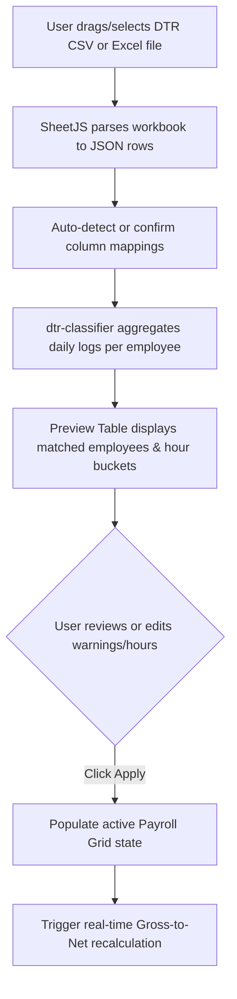

# Phase 3 Research: Interactive Payroll Overhaul UI & DTR Import

> **Phase**: 3  
> **Topic**: Interactive Payroll Grid, DOLE Rate Settings, and DTR CSV Parsing & Auto-Classification  
> **Related Requirements**: REQ-06 (Interactive Overhaul Payroll Grid)  

---

## 1. Current Structure of `PayrollView.tsx` & Multi-Tab Overhaul Design

### Current Architecture (`src/renderer/src/components/PayrollView.tsx:1-683`)

1. **State & Sub-Views**:
   - Manages three sub-views via `view: 'RUN' | 'DIRECTORY' | 'HISTORY'` ([PayrollView.tsx:6](file:///C:/Users/MY%20PC/.gemini/antigravity/worktrees/7ecb2df6-06d6-441a-b3b9-513b2e039ea5/subagent-Phase-3-Researcher-gsd-researcher-01396e09/src/renderer/src/components/PayrollView.tsx#L6)).
   - Sub-view navigation is rendered in the top-right header via buttons ([PayrollView.tsx:236-241](file:///C:/Users/MY%20PC/.gemini/antigravity/worktrees/7ecb2df6-06d6-441a-b3b9-513b2e039ea5/subagent-Phase-3-Researcher-gsd-researcher-01396e09/src/renderer/src/components/PayrollView.tsx#L236-L241)).
   - **`RUN` View**:
     - Flat table with basic inline editable numerical inputs for `basePay`, `overtime`, `nightDiff`, `otherEarnings`, `sss`, `philhealth`, `pagibig`, `cashAdvance`, `licenseFee`, `otherDeductions`, and `tax` ([PayrollView.tsx:316-339](file:///C:/Users/MY%20PC/.gemini/antigravity/worktrees/7ecb2df6-06d6-441a-b3b9-513b2e039ea5/subagent-Phase-3-Researcher-gsd-researcher-01396e09/src/renderer/src/components/PayrollView.tsx#L316-L339)).
     - Uses naive local arithmetic `handleUpdateItem` ([PayrollView.tsx:100-111](file:///C:/Users/MY%20PC/.gemini/antigravity/worktrees/7ecb2df6-06d6-441a-b3b9-513b2e039ea5/subagent-Phase-3-Researcher-gsd-researcher-01396e09/src/renderer/src/components/PayrollView.tsx#L100-L111)) that directly adds/subtracts user-typed numbers without formula rate multipliers or statutory table lookups.
     - Lacks attendance demerits (Lates, Undertime, Absences).
     - Overtime is entered as a manual raw peso figure rather than hours multiplied by hourly rate and DOLE category multipliers.
     - Lacks DTR import capability and DOLE rate multiplier configuration.
   - **`DIRECTORY` View** ([PayrollView.tsx:448-555](file:///C:/Users/MY%20PC/.gemini/antigravity/worktrees/7ecb2df6-06d6-441a-b3b9-513b2e039ea5/subagent-Phase-3-Researcher-gsd-researcher-01396e09/src/renderer/src/components/PayrollView.tsx#L448-L555)):
     - Lists employees with active/archived filters and add/edit modal for government IDs (TIN, SSS, PhilHealth, Pag-IBIG).
   - **`HISTORY` View** ([PayrollView.tsx:363-443](file:///C:/Users/MY%20PC/.gemini/antigravity/worktrees/7ecb2df6-06d6-441a-b3b9-513b2e039ea5/subagent-Phase-3-Researcher-gsd-researcher-01396e09/src/renderer/src/components/PayrollView.tsx#L363-L443)):
     - Displays past payroll runs and printable payslip modal (`window.print()`).

---

### Overhaul Architecture: 5-Tab Dedicated Workspace

To meet REQ-06 and provide clinic-grade payroll administration, `PayrollView.tsx` should be refactored into a cohesive tabbed navigation workspace:

```
┌────────────────────────────────────────────────────────────────────────┐
│                        Human Resources & Payroll                       │
│  [📋 Payroll Grid] [⚙️ DOLE Rate Settings] [📥 DTR Import] [📜 History] [👥 Directory] │
└────────────────────────────────────────────────────────────────────────┘
```

#### 1. Tab 1: Overhauled Payroll Grid (Matching Clinic Paper/Excel Rate Sheets)
- **Design Pattern**: Multi-column grouped tabular spreadsheet with collapsible sections and sticky headers:
  1. **Employee Profile**: Code, Full Name, Position, Monthly Base, Hourly Rate (`(Monthly × 12) / 261 / 8`).
  2. **Attendance & Demerits**:
     - Late minutes & deduction amount
     - Undertime hours/minutes & deduction amount
     - Absence days & deduction amount
     - *Net Basic Pay* = `(Monthly / 2) - Total Demerits`
  3. **DOLE Overtime & Premium Pay** (Hours inputs × Hourly Rate × DOLE Multiplier):
     - Regular OT (125%), Night Diff (110%), Regular Night OT (137.5%)
     - Rest Day (130%), Rest Day OT (169%), Rest Day ND (143%)
     - Special Holiday (130%), Special Holiday OT (169%), Special Holiday ND (143%)
     - Special Holiday Rest Day (150%), Special Holiday Rest Day OT/ND
     - Legal Holiday (200%)
     - *View Toggle*: "Compact Summary" vs "Full 16-Category Breakdown" (or expandable modal/popover per row).
  4. **Allowances**: Taxable Allowances, De Minimis / Non-taxable Allowances.
  5. **Total Gross Pay**: `Net Basic Pay + Total Premiums + Allowances`.
  6. **Pre-Tax Statutory Deductions** (Auto-calculated via Phase 2 formulas):
     - SSS Employee Share (from SSS MSC table)
     - PhilHealth Employee Share (5% split with floor/ceiling)
     - Pag-IBIG Employee Share (capped at ₱100/semi-mo)
  7. **Withholding Tax**: Semi-Monthly BIR TRAIN Law bracket calculation.
  8. **Post-Tax Loan Amortizations**:
     - Vale / Cash Advance deduction
     - SSS Loan deduction
     - Pag-IBIG Loan deduction
     - Other deductions (license fee, uniforms, etc.)
  9. **Summary / Net Pay**: Total Deductions, Net Take-Home Pay.
- **Interactivity**:
  - Live formula updates: Editing any hour, late minute, or absence immediately recalculates demerits, premiums, taxable base, statutory shares, tax, and net pay.
  - Sticky bottom summary bar with totals for Gross, Demerits, SSS, PhilHealth, Pag-IBIG, Tax, Loans, and Net Payout.
  - "Post Payroll" transaction trigger validating negative nets and empty entries.

#### 2. Tab 2: DOLE Rate Multiplier Settings
- Form interface providing visual access to the 16 DOLE multiplier rates persisted in `system_settings` ([prisma/schema.prisma:290-305](file:///C:/Users/MY%20PC/.gemini/antigravity/worktrees/7ecb2df6-06d6-441a-b3b9-513b2e039ea5/subagent-Phase-3-Researcher-gsd-researcher-01396e09/prisma/schema.prisma#L290-L305)).
- Displays DOLE standard baseline percentages alongside current clinic configured values.
- Actions: "Save Changes", "Reset to Statutory DOLE Defaults".

#### 3. Tab 3: DTR CSV Import Modal / Tab
- Drag-and-drop / file picker for DTR logs (`.csv`, `.xlsx`, `.xls`).
- Header mapping configuration and file format detection (Consolidated Timesheet vs Raw Daily Punch Card).
- Auto-classification preview table matching employee names/IDs.
- Action: "Apply to Payroll Grid" to populate active payroll run hours and demerits.

#### 4. Tab 4: Payslip History & Tab 5: Employee Directory
- Retain existing robust functionality with updated itemized payslip modal matching Phase 2 schema.

---

## 2. IPC Channels & Preload Wiring

To support rate settings management, real-time calculations, and batch payroll generation, the following IPC contracts must be implemented across `src/main/index.ts`, `src/preload/index.ts`, and `src/preload/index.d.ts`:

### A. IPC Channel Matrix

| IPC Channel | Direction | Payload | Return Value | Purpose |
|---|---|---|---|---|
| `payroll:getSettings` | Renderer -> Main | None | `PayrollMultipliers` object | Fetches active DOLE multiplier settings from `SystemSetting` |
| `payroll:updateSettings` | Renderer -> Main | `Partial<PayrollMultipliers>` | `{ success: boolean, error?: string }` | Updates 16 DOLE multiplier decimals in `SystemSetting` |
| `payroll:calculateEmployee` | Renderer -> Main | `{ monthlySalary: number, hours: OvertimeHours, demerits: AttendanceDemerits, allowances?: any[], loans?: any[] }` | Full Gross-to-Net breakdown | Evaluates Phase 2 computation pipeline for a single employee |
| `payroll:batchCalculate` | Renderer -> Main | `{ employees: Array<{ id: number, monthlySalary: number, hours: OvertimeHours, demerits: AttendanceDemerits }> }` | `Array<CalculatedEmployee>` | Evaluates full payroll run; automatically queries active allowances & loans from DB |
| `payroll:getAllowancesAndLoans` | Renderer -> Main | `{ employeeId: number }` | `{ allowances: EmployeeAllowance[], loans: EmployeeLoan[] }` | Retrieves active allowances and loan balances for an employee |
| `process-payroll` *(existing)* | Renderer -> Main | Extended payload with `processedLoans` and itemized lines | `{ success: boolean, referenceNo: string }` | Executes atomic transaction updating loans, posting GL lines, and creating payslips |

### B. Implementation Details in `src/main/services/payroll.service.ts`

Add settings mutation and batch calculation methods to `PayrollService`:

```typescript
// src/main/services/payroll.service.ts

export const PayrollService = {
  // ... existing methods ...

  async updatePayrollSettings(multipliers: Partial<PayrollMultipliers>) {
    const existing = await prisma.systemSetting.findFirst();
    if (existing) {
      await prisma.systemSetting.update({
        where: { id: existing.id },
        data: multipliers
      });
    } else {
      await prisma.systemSetting.create({
        data: multipliers
      });
    }
    return { success: true };
  },

  async batchCalculatePayroll(employeeInputs: Array<{
    id: number;
    monthlySalary: number;
    hours: OvertimeHours;
    demerits: AttendanceDemerits;
  }>) {
    const settings = await this.getPayrollSettings();
    const results = [];

    for (const input of employeeInputs) {
      const allowances = await prisma.employeeAllowance.findMany({
        where: { employee_id: input.id }
      });
      const loans = await prisma.employeeLoan.findMany({
        where: { employee_id: input.id, is_active: true }
      });

      const calc = await this.calculateEmployeePayroll(
        input.monthlySalary,
        input.hours,
        input.demerits,
        allowances,
        loans
      );

      results.push({
        employee_id: input.id,
        ...calc
      });
    }

    return results;
  }
};
```

### C. Main Process Handlers (`src/main/index.ts`)

Wire handlers adjacent to existing payroll IPC lines ([src/main/index.ts:719-800](file:///C:/Users/MY%20PC/.gemini/antigravity/worktrees/7ecb2df6-06d6-441a-b3b9-513b2e039ea5/subagent-Phase-3-Researcher-gsd-researcher-01396e09/src/main/index.ts#L719-L800)):

```typescript
ipcMain.handle('payroll:getSettings', async () => {
  return await PayrollService.getPayrollSettings();
});

ipcMain.handle('payroll:updateSettings', async (_, settings) => {
  try {
    const result = await PayrollService.updatePayrollSettings(settings);
    await AuditService.logAction('SYSTEM', 'PAYROLL SETTINGS', 'Updated DOLE rate multipliers');
    return result;
  } catch (err: any) {
    return { success: false, error: err.message };
  }
});

ipcMain.handle('payroll:calculateEmployee', async (_, data) => {
  return await PayrollService.calculateEmployeePayroll(
    data.monthlySalary,
    data.hours,
    data.demerits,
    data.allowances || [],
    data.loans || []
  );
});

ipcMain.handle('payroll:batchCalculate', async (_, { employees }) => {
  return await PayrollService.batchCalculatePayroll(employees);
});
```

### D. Preload Bridge (`src/preload/index.ts` & `src/preload/index.d.ts`)

Expose methods on `window.api` / `window.electronAPI`:

```typescript
// In src/preload/index.ts:
getPayrollSettings: () => ipcRenderer.invoke('payroll:getSettings'),
updatePayrollSettings: (settings: any) => ipcRenderer.invoke('payroll:updateSettings', settings),
calculateEmployeePayroll: (data: any) => ipcRenderer.invoke('payroll:calculateEmployee', data),
batchCalculatePayroll: (data: any) => ipcRenderer.invoke('payroll:batchCalculate', data),
```

---

## 3. DTR CSV Parsing & Auto-Classification Architecture

### Process Placement: Renderer-Side Parsing with Modular Pure Classifier

- **Why Renderer Process?**:
  1. `XLSX` (SheetJS) is already imported and bundled in the renderer (`import * as XLSX from 'xlsx'` in [PayrollView.tsx:3](file:///C:/Users/MY%20PC/.gemini/antigravity/worktrees/7ecb2df6-06d6-441a-b3b9-513b2e039ea5/subagent-Phase-3-Researcher-gsd-researcher-01396e09/src/renderer/src/components/PayrollView.tsx#L3) and [ReconciliationView.tsx:291](file:///C:/Users/MY%20PC/.gemini/antigravity/worktrees/7ecb2df6-06d6-441a-b3b9-513b2e039ea5/subagent-Phase-3-Researcher-gsd-researcher-01396e09/src/renderer/src/components/ReconciliationView.tsx#L291)).
  2. Local parsing via `XLSX.read(arrayBuffer, { type: 'array' })` provides instantaneous drag-and-drop feedback without serializing multi-megabyte CSV files across IPC channels.
  3. Immediate client-side validation allows users to map mismatched headers, preview errors, and fix employee name discrepancies before submitting to the database.
- **Modular Classifier Module**:
  - The classification engine should be structured in a pure utility file:  
    `src/renderer/src/utils/dtr-classifier.ts` (or shared utility).
  - Pure functions take parsed raw records + employee directory and return categorized hours and demerits. No Node.js DOM dependencies, making it directly testable via Jest.

---

### DTR Format Support & Normalization

The classifier will support two standard clinic DTR formats:

#### Format A: Consolidated Timesheet CSV (Pre-calculated Hours)
Columns: `Employee ID / Name`, `Late (mins)`, `Undertime (hrs/mins)`, `Absences (days)`, `Regular OT`, `Night Diff`, `Rest Day`, `Special Holiday`, `Legal Holiday`.
- Direct 1:1 mapping of columns into `AttendanceDemerits` and `OvertimeHours`.

#### Format B: Daily Punch Log CSV (Biometric Time Card)
Columns: `Employee ID / Name`, `Date` (YYYY-MM-DD), `Time In` (HH:mm), `Time Out` (HH:mm), `Day Type` (`REGULAR`, `REST_DAY`, `SPECIAL_HOLIDAY`, `SPECIAL_HOLIDAY_REST_DAY`, `LEGAL_HOLIDAY`).

---

### Classification Rules Matrix (16 DOLE Categories)

For any daily punch record, the hours are classified along two orthogonal dimensions:
1. **Work Window**: Daytime (`06:00 – 22:00`) vs Night Differential (`22:00 – 06:00`).
2. **Work Duration**: First 8 Hours (Regular Shift) vs Excess Hours (>8 Hours = Overtime).

```
                      ┌───────────────────────┬────────────────────────┐
                      │ First 8 Hours (Shift) │ Overtime (> 8 Hours)   │
┌─────────────────────┼───────────────────────┼────────────────────────┤
│ Regular Workday     │ Base Pay (Included)   │ regular_ot (1.25)      │
│                     │ regular_night (1.10)  │ regular_night_ot (1.375│
├─────────────────────┼───────────────────────┼────────────────────────┤
│ Rest Day            │ rest_day (1.30)       │ rest_day_ot (1.69)     │
│                     │ rest_day_night (1.43) │ rest_day_night_ot(1.859│
├─────────────────────┼───────────────────────┼────────────────────────┤
│ Special Holiday     │ special_holiday (1.30)│ special_holiday_ot(1.69│
│                     │ special_holiday_night │ special_holiday_night_ot
├─────────────────────┼───────────────────────┼────────────────────────┤
│ Special Holiday on  │ special_holiday_rest_ │ special_holiday_rest_  │
│ Rest Day            │ day_rate (1.50)       │ day_ot_rate (1.95)     │
│                     │ special_holiday_rest_ │ special_holiday_rest_  │
│                     │ day_night_rate (1.65) │ day_night_ot (2.145)   │
├─────────────────────┼───────────────────────┼────────────────────────┤
│ Regular / Legal Hol │ legal_holiday (2.00)  │ legal_holiday_rate     │
└─────────────────────┴───────────────────────┴────────────────────────┘
```

#### Shift Demerit Calculation:
- **Late Minutes**: `Math.max(0, actualTimeIn - scheduledShiftStart)`.
- **Undertime Minutes**: `Math.max(0, scheduledShiftEnd - actualTimeOut)`.
- **Absence Days**: If record marked as `ABSENT` or scheduled shift has no time punch.

#### Night Differential (ND) Window Computation:
- Night Differential window spans `22:00` (10:00 PM) to `06:00` (6:00 AM) next day.
- A punch interval `[T_in, T_out]` is segmented into:
  - Total duration = `(T_out - T_in) - 1 hr unpaid break` (if shift > 5 hrs).
  - Night hours = duration of `[T_in, T_out]` overlapping `[22:00, 06:00]`.
  - Day hours = `Total duration - Night hours`.
  - First 8 hours are assigned to the base shift bucket; remaining excess hours (>8h) are assigned to overtime buckets.

---

### Step-by-Step DTR Import Workflow in UI



1. **Upload & Parse**: User selects DTR `.csv` or `.xlsx`. SheetJS parses rows into objects.
2. **Auto-Match Employee**: Matches rows to active employees using `employee_id` or case-insensitive name matching (`first_name + ' ' + last_name`). Unmatched names are flagged with warning badges.
3. **Classification & Aggregation**: Aggregates total late minutes, undertime hours, absence days, and hours across the 16 DOLE categories for each employee over the payroll period.
4. **Interactive Reconciliation Preview**: Displays summary cards per employee with warnings for missing time-outs or unmatched IDs.
5. **Apply to Grid**: Injects aggregated `OvertimeHours` and `AttendanceDemerits` into the Payroll Grid state, triggering instant recalculation of Net Pay.

---

## 4. Risks & Architectural Recommendations

1. **Table Column Density**:
   - Displaying all 16 DOLE categories simultaneously across 30+ table columns can cause horizontal scrolling fatigue.
   - *Recommendation*: Use collapsible column groups (e.g. `[Demerits (3)]`, `[Premiums (16)]`, `[Statutory (3)]`, `[Loans (4)]`) with a quick toggle between "Compact Summary View" and "DOLE Expanded View", plus an employee row inspection drawer.
2. **Formula Divergence Between Frontend and Backend**:
   - Implementing calculations on both frontend and backend risks math discrepancies.
   - *Recommendation*: Expose `payroll:calculateEmployee` and `payroll:batchCalculate` over IPC so the frontend invokes the exact same Phase 2 backend engine as the single source of truth, or share pure calculator functions between processes.
3. **Unmatched DTR Names**:
   - Biometric punch clocks often output names differently (e.g., `Dela Cruz, Juan` vs `Juan Dela Cruz`).
   - *Recommendation*: Provide an intuitive dropdown in the DTR preview table allowing the user to link unmatched CSV rows to existing employee profiles with 1-click confirmation.
